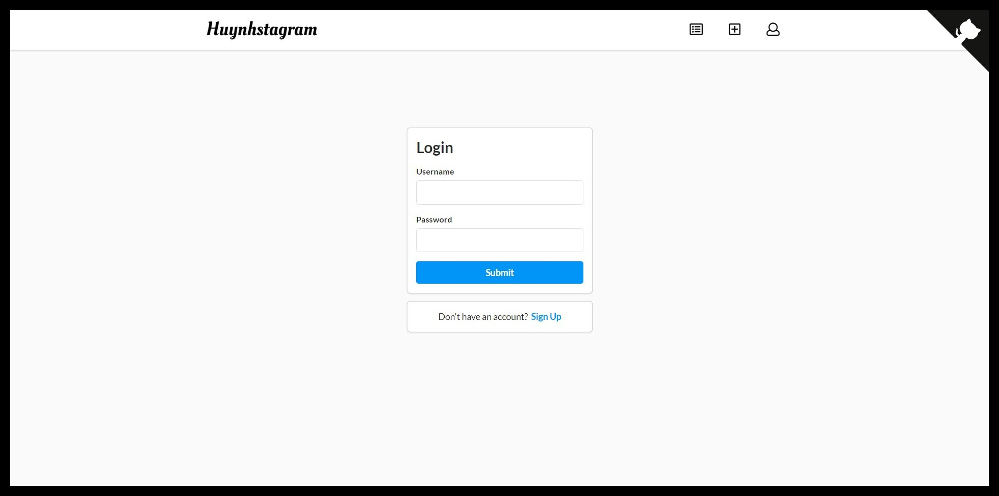
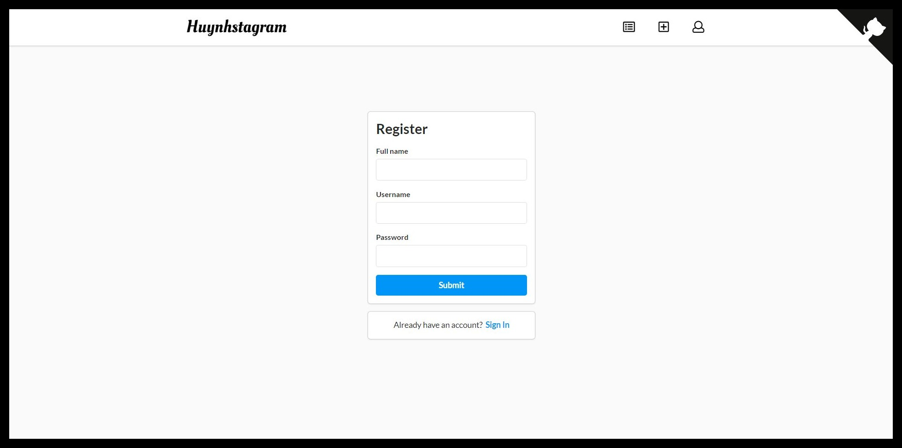
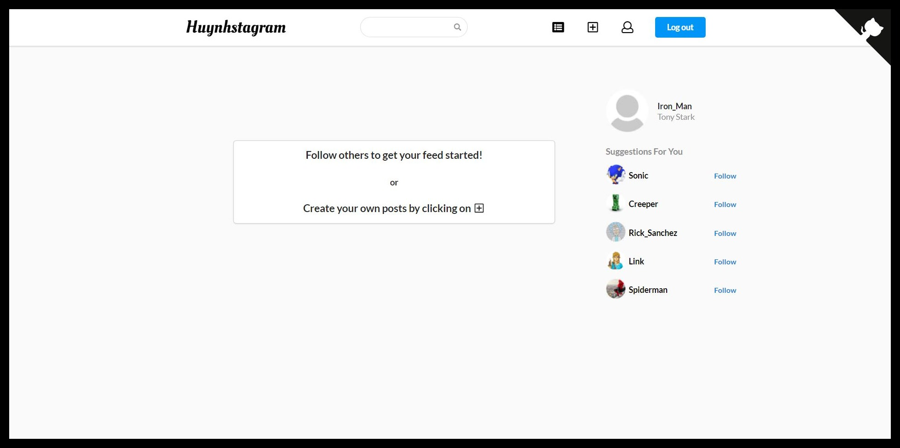
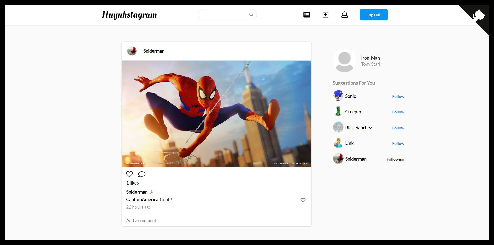
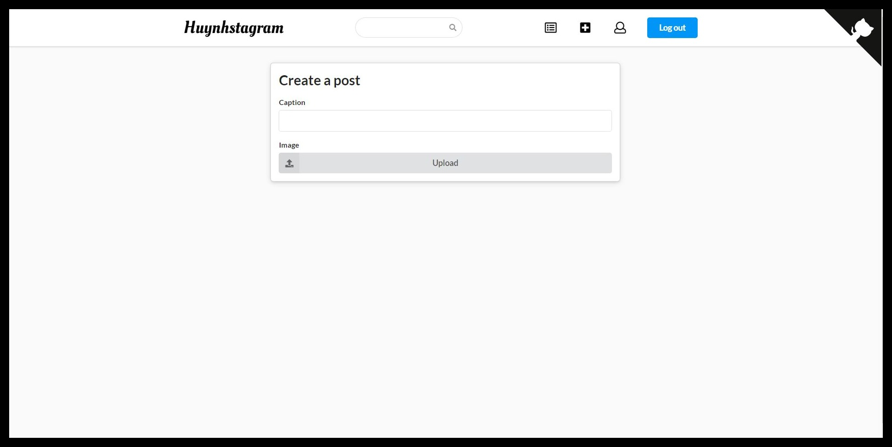
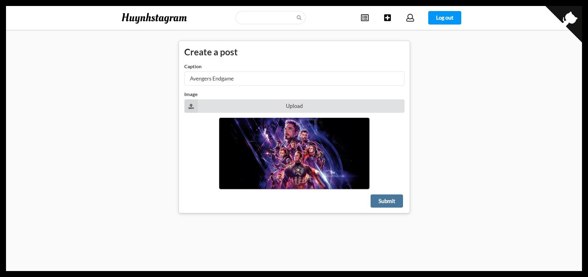
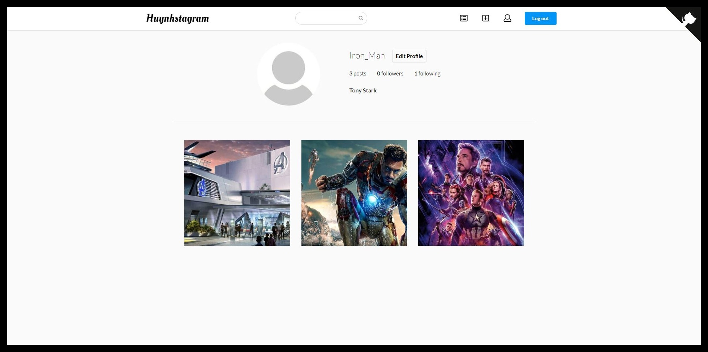
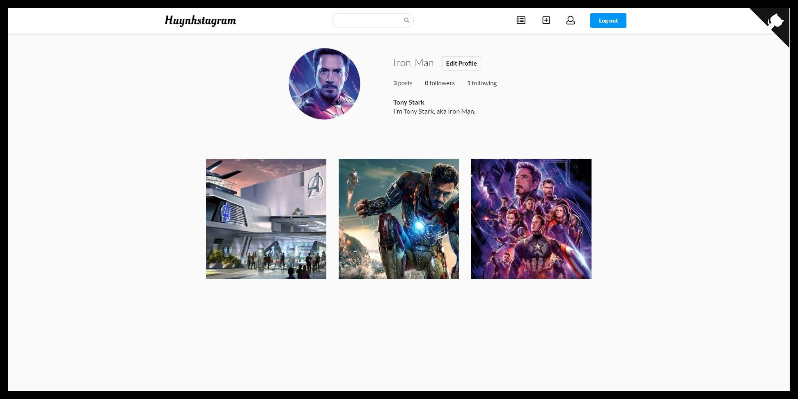
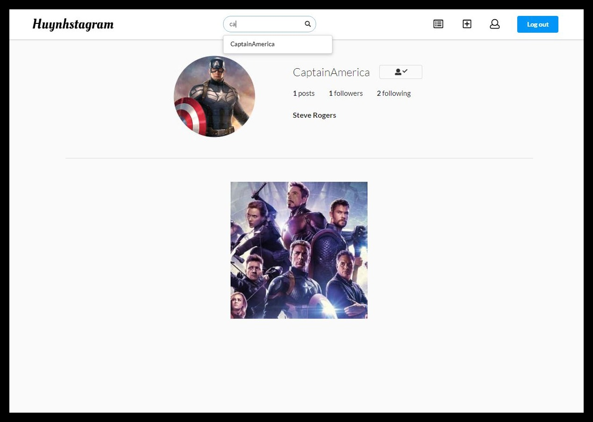

# Huynhstagram
An Instagram web-application clone where users can create and interact with posts as well as other users. 

[Huynhstagram Server Repo](https://github.com/Huynheddie/huynhstagram-server)

## Built With
- React
- Node.JS
- Express
- MongoDB
- Cloudinary

## Packages Used

1. [React Router](https://www.npmjs.com/package/react-router)
2. [React GitHub Corner](https://www.npmjs.com/package/react-github-corner)
3. [Semantic UI React](https://react.semantic-ui.com/)
4. [Cloudinary React Library](https://github.com/cloudinary/cloudinary-react)

## Supported Browsers

- Google Chrome (recommended)
- Firefox

## Images

  
Login and Register Page

  
  
  

  
Home Page

  

### After following a user from the **Suggested Users** section will update the Home feed with new posts.

  

  
Creating a Post

  
  

### Updated Home feed with newly created post

  

  
User Profile Page

  
  
  
  ### Edit Biography
  
  
  
  ### Change Profile Picture
  
  
  
  ### Updated User Profile
  
  

  
Followers and Following

  
  

  
Search Bar

  
  

